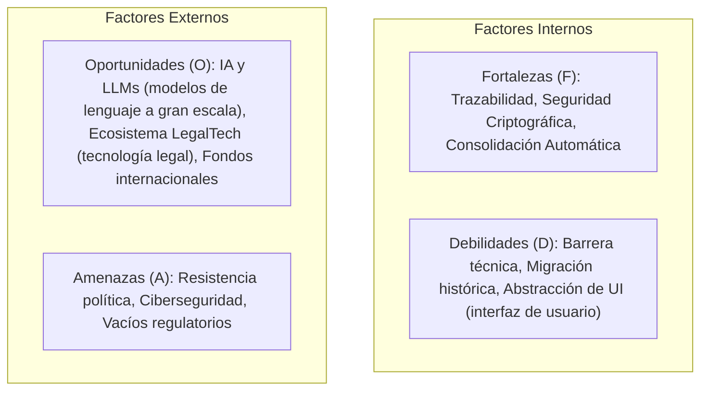
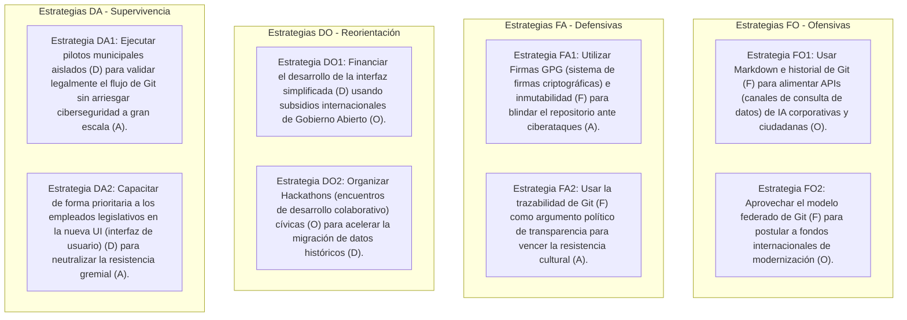

# Análisis FODA Profesional e Integral: Proyecto Leyes.ar

Este documento presenta una matriz de planificación estratégica avanzada (FODA Cruzado) para la implementación de un sistema de control de versiones y colaboración basado en Git para la legislación en los tres niveles del Estado argentino (Nacional, Provincial y Municipal).

---

## 1. Resumen Ejecutivo

La modernización del sistema de gestión legislativa mediante Git representa un salto cualitativo desde el **"Derecho en papel"** hacia el **"Derecho como Código"**. Este análisis evalúa la viabilidad del proyecto, cruzando las capacidades técnicas inherentes de Git (factores internos) con el contexto político, social y tecnológico de la Argentina (factores externos). 

El objetivo de este documento es dotar al proyecto de un marco de decisión estratégico para mitigar riesgos regulatorios y políticos, al tiempo que maximiza el impacto de la transparencia pública y la integración con la Inteligencia Artificial.

---

## 2. Análisis Detallado de los Cuatro Pilares

*(Nota: A continuación se desglosan los pilares en detalle técnico, legal y operativo).*

### A. Fortalezas (Factores Internos - Positivos)
Son las capacidades técnicas intrínsecas que aporta la adopción de Git al ecosistema normativo:

1.  **Trazabilidad Granular Absoluta (`git blame` -comando de rastreo de autoría-):** Capacidad de auditar el origen exacto de cada palabra, coma o artículo de una ley, vinculándolo directamente al commit (registro de cambio), autor y fecha de modificación.
2.  **Seguridad y Autenticidad Criptográfica:** Cada cambio (commit -registro de cambio-) y cada sanción (merge -fusión-) pueden firmarse digitalmente con llaves criptográficas (GPG -sistema de firmas criptográficas- / Firma Digital Nacional), imposibilitando la alteración clandestina del texto.
3.  **Consolidación Automatizada Inmediata:** Eliminación del retraso de meses o años en la publicación de Textos Ordenados. Al fusionar una enmienda, el texto vigente se compila e indexa al instante en la rama principal (`main` -rama de producción-).
4.  **Arquitectura Distribuida y Federada:** Git está diseñado para trabajar de manera descentralizada. Se alinea de forma nativa con el sistema federal argentino, permitiendo que cada provincia y municipio gestione sus propios repositorios de manera autónoma, pero compartiendo estándares comunes de búsqueda y enlace.
5.  **Control de Calidad Automatizado (CI/CD -Integración y Despliegue Continuos / Automatización de procesos-):** Posibilidad de correr pruebas sintácticas e informáticas (linters -validadores automáticos de formato-) para verificar que las leyes no tengan referencias cruzadas rotas o artículos duplicados antes de su votación.

### B. Debilidades (Factores Internos - Negativos)
Son los límites técnicos o desafíos de diseño propios del proyecto que deben resolverse internamente:

1.  **Barrera de Entrada Técnica (Curva de Aprendizaje):** Git es una herramienta diseñada para desarrolladores. Los legisladores, abogados y ciudadanos comunes no pueden utilizar comandos de consola. El proyecto depende críticamente del desarrollo de una interfaz visual (UI -interfaz de usuario-) extremadamente amigable que abstraiga la complejidad técnica.
2.  **Complejidad en la Migración de Datos Históricos:** Convertir cientos de miles de leyes y ordenanzas desde PDFs (formatos estáticos de documento) escaneados o HTMLs (páginas web) mal estructurados a Markdown limpio con YAML estructurado (metadatos estructurados en texto plano) es un proceso masivo propenso a errores que requiere validación semi-automatizada.
3.  **Limitación de Formato de Texto Plano:** Las leyes a veces incluyen anexos con fórmulas matemáticas complejas, planos topográficos, o tablas multidimensionales complejas que son difíciles de representar en Markdown estándar sin extensiones específicas.
4.  **Dependencia del Desarrollo de Software Propio:** Para que el sistema funcione a nivel estatal, se debe diseñar, mantener y auditar un editor colaborativo soberano y seguro, lo que exige presupuesto y equipo de ingeniería especializado.

### C. Oportunidades (Factores Externos - Positivos)
Son las tendencias del entorno digital y político que el proyecto puede aprovechar para crecer y legitimarse:

1.  **Revolución de la Inteligencia Artificial (LLMs -modelos de lenguaje a gran escala- y RAG -Generación Aumentada por Recuperación-):** Al proveer un repositorio estructurado, limpio y actualizado (Single Source of Truth -Fuente Única de Verdad-), el proyecto se convierte en el insumo perfecto para entrenar y alimentar modelos de IA que respondan consultas legales de la ciudadanía y empresas sin alucinaciones.
2.  **Desarrollo del Ecosistema LegalTech (tecnología legal) y GovTech (tecnología de gestión pública):** La apertura de datos legislativos mediante APIs (interfaces de programación / canales automáticos de consulta) de Git impulsará un mercado de startups tecnológicas dedicadas al compliance (cumplimiento normativo regulatorio) automatizado, gestión de contratos y análisis predictivo de fallos judiciales.
3.  **Políticas Globales de Gobierno Abierto:** Existen convocatorias y fondos no reembolsables de organismos internacionales (Banco Interamericano de Desarrollo, Banco Mundial, Open Government Partnership) destinados específicamente a financiar proyectos de transparencia institucional y modernización del Estado.
4.  **Estandarización y Armonización Normativa Federal:** La oportunidad de unificar la presentación formal de las normas del país, facilitando la búsqueda cruzada de jurisprudencia y ordenanzas entre distintas provincias y municipios.

### D. Amenazas (Factores Externos - Negativos)
Son los riesgos externos (políticos, sociales, de seguridad o legales) que pueden bloquear o deslegitimar el proyecto:

1.  **Resistencia Cultural y Política a la Transparencia:** Sectores burocráticos o políticos pueden oponerse a un sistema que expone públicamente el historial de cambios, debates, y qué asesores modificaron líneas específicas de proyectos impositivos o de presupuesto.
2.  **Vacíos Legales y Fricción Regulatoria:** La normativa actual exige firmas físicas o procedimientos digitales tradicionales. Validar judicialmente un "Merge (fusión)" o un "Commit (registro de cambio)" como promulgación legal requerirá reformas constitucionales o de leyes de procedimiento administrativo.
3.  **Amenazas a la Ciberseguridad Nacional:** Los repositorios públicos del Estado son blanco constante de ataques. Si la infraestructura central es hackeada o se suplantan identidades para modificar leyes vigentes en Git, la crisis institucional sería masiva.
4.  **Brecha Digital e Inequidad de Acceso:** Si el sistema web no se diseña con altos estándares de accesibilidad, se corre el riesgo de centralizar el acceso real a la legislación únicamente en profesionales y sectores urbanos con conectividad avanzada.
5.  **Conflictividad Sindical:** Resistencia por parte de los gremios estatales al interpretar la automatización de la compilación normativa como una amenaza para los puestos de trabajo dedicados a la redacción y ordenamiento de digestos tradicionales.

---

## 3. Matriz FODA Cruzada: Estrategias de Acción

Para convertir este análisis en una herramienta de planificación, cruzamos las variables para generar estrategias concretas:

### Estrategias FO (Fortalezas + Oportunidades): Enfoque de Crecimiento
*   **Estrategia FO1 (Datos Abiertos para IA):** Utilizar la fortaleza de los archivos estructurados en Markdown y la inmutabilidad de la rama principal (`main` -rama de producción-) para exponer APIs (canales automáticos de consulta de datos) REST/GraphQL públicas. Esto facilitará que startups locales de LegalTech (tecnología aplicada al derecho) entrenen inteligencias artificiales soberanas especializadas en derecho argentino, posicionando al país a la vanguardia regulatoria.
*   **Estrategia FO2 (Consolidación Federada):** Presentar la arquitectura federada de Git como el modelo definitivo de integración federal ante el BID, obteniendo recursos para dotar a municipios pequeños de tecnología de punta de forma gratuita.

### Estrategias FA (Fortalezas + Amenazas): Enfoque de Defensa
*   **Estrategia FA1 (Consolidación Criptográfica):** Mitigar la amenaza de ciberataques y suplantación de identidad mediante la firma digital obligatoria GPG (sistema de firmas criptográficas) por parte del cuerpo técnico calificado del digesto (Consolidadores). Un merge (fusión) a la rama principal (`main` -rama de producción-) solo se valida si cuenta con la firma digital que da fe de la correspondencia exacta entre el commit (registro de cambio) de Git y el acta de sanción legislativa.
*   **Estrategia FA2 (Trazabilidad como Bandera):** Utilizar la trazabilidad de Git para combatir la resistencia política. La demanda social por transparencia hace que oponerse a un sistema que audita el origen de las leyes tenga un alto costo político para los opositores al cambio.

### Estrategias DO (Debilidades + Oportunidades): Enfoque de Adaptación
*   **Estrategia DO1 (Diseño Financiado de UI -interfaz de usuario-):** Utilizar de manera estratégica fondos internacionales de modernización pública para contratar expertos en Experiencia de Usuario (UX/UI -experiencia e interfaz de usuario-) y desarrollar un editor web colaborativo soberano y de código abierto (abstracción total de Git), resolviendo la debilidad de la curva de aprendizaje técnica.
*   **Estrategia DO2 (Crowdsourcing -colaboración abierta distribuida- de Digestos):** Canalizar el interés de la comunidad tecnológica y estudiantes de derecho a través de Hackathons (encuentros de desarrollo colaborativo) nacionales para digitalizar y etiquetar los digestos jurídicos históricos en formato Markdown, resolviendo el cuello de botella de la migración de datos.

### Estrategias DA (Debilidades + Amenazas): Enfoque de Supervivencia
*   **Estrategia DA1 (Despliegue Híbrido de Transición):** Durante la etapa piloto, mantener la coexistencia del Boletín Oficial tradicional y el repositorio Git, pero estableciendo regulaciones para que el PDF oficial sea una exportación visual directa del estado del repositorio de Git, preparando el camino reglamentario para consagrar a Git como la única fuente primaria de derecho.
*   **Estrategia DA2 (Capacitación Inclusiva Gremial):** Involucrar a los empleados de carrera de los parlamentos en el codiseño del editor web. Demostrarles que la herramienta no elimina puestos de trabajo, sino que los jerarquiza (pasan de transcribir textos en Word a auditar la calidad sintáctica de las leyes con linters -validadores automáticos de consistencia-).

---

## 4. Conclusiones y Hoja de Ruta Recomendada

Para que el proyecto **Leyes.ar** sea viable en el contexto argentino, el análisis FODA profesional nos indica que **el factor crítico de éxito no es técnico, sino institucional y de diseño de interfaz**:

1.  **Corto Plazo (Meses 1-6):** Enfocarse en la **Estrategia DO2 (Hackathons -encuentros de desarrollo-)** para migrar el primer digesto de prueba, y en la **Estrategia DA1 (Despliegue Híbrido)** operando en paralelo con un Concejo Deliberante municipal piloto.
2.  **Mediano Plazo (Meses 6-18):** Desarrollar la interfaz visual simplificada del editor colaborativo (**Estrategia DO1**) y proponer las reformas reglamentarias legislativas pertinentes para dar validez formal a las firmas criptográficas en Git (**Estrategia FA1**).
3.  **Largo Plazo (Mes 18+):** Despliegue federado a nivel provincial y apertura de las APIs (canales de consulta de datos) estructuradas para potenciar el mercado de IA legal y transparencia cívica (**Estrategia FO1**).

