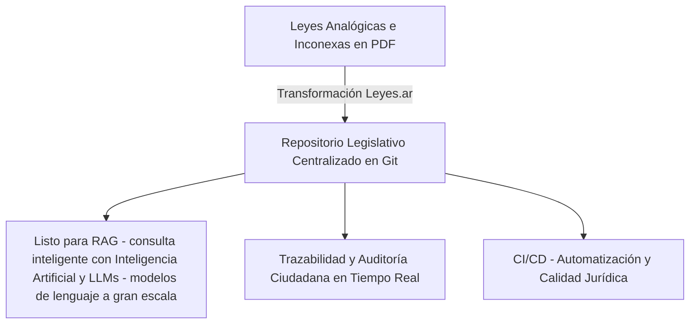
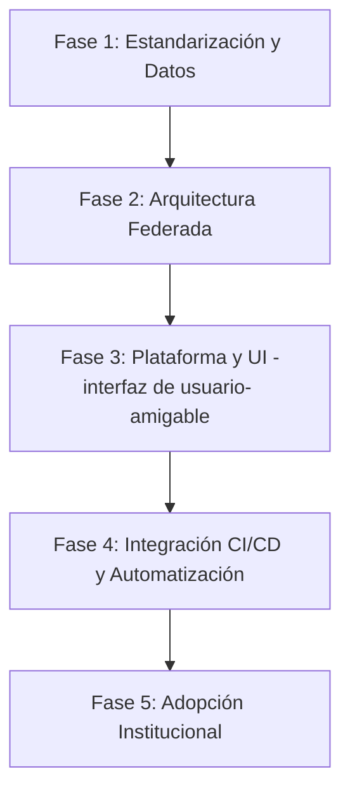

# Leyes.ar: Control de Versiones para la Legislación Argentina

Este documento presenta la propuesta conceptual, justificación tecnológica y estrategia de implementación para aplicar **Git** como sistema de control de versiones y colaboración en todo el cuerpo normativo argentino (Leyes Nacionales, Provinciales y Ordenanzas Municipales).

---

## Presentación e Introducción Gerencial (Resumen Ejecutivo)

### ¿Qué es Leyes.ar?
**Leyes.ar** es un proyecto estratégico nacional que propone modernizar la gestión, publicación y co-creación del cuerpo normativo argentino (Nacional, Provincial y Municipal) utilizando la tecnología de control de versiones **Git** y metodologías de desarrollo colaborativo. Su esencia radica en tratar a **la legislación como un sistema de código abierto** (texto estructurado), permitiendo que la evolución de las leyes sea transparente, auditable y automatizable.

### La Esencia del Proyecto (Elevator Pitch - presentación breve e impactante)
El sistema legislativo actual publica normas en formatos estáticos (PDF o escaneados) y realiza modificaciones mediante lenguaje natural indirecto (*"Reemplácese el art. X..."*), lo que genera dispersión y requiere un laborioso proceso de consolidación manual que insume tiempo y comete errores.

**Leyes.ar transforma este paradigma:**
1. **La Ley como Texto Estructurado (Markdown - formato de texto plano estructurado):** Las normas se convierten en archivos de texto plano estructurado dentro de repositorios seguros.
2. **Historial de Cambios en una Línea de Tiempo (Git):** Cada reforma es un "commit" (registro de cambio o confirmación) que muestra con precisión quirúrgica qué palabra cambió, cuándo, quién lo propuso y por qué.
3. **Co-creación y Transparencia en la Redacción (Pull Requests - propuestas de incorporación de cambios):** Los borradores y proyectos de ley se estructuran de forma transparente sobre la redacción final propuesta, facilitando el trabajo de comisiones.
4. **Calidad Garantizada (CI/CD - Integración y Despliegue Continuo / Automatización de procesos):** Validadores automáticos detectan contradicciones, errores de numeración o referencias normativas rotas antes de que se sancione la ley.



### Retorno de Inversión y Beneficios Gerenciales
*   **Eficiencia Operativa:** Reduce drásticamente el tiempo y costo de compilación de Digestos Jurídicos. La consolidación es automática tras la firma técnica.
*   **Seguridad y Consistencia Jurídica:** Minimiza las lagunas normativas y contradicciones entre leyes mediante validaciones automáticas.
*   **Preparación para la Era de la IA:** Facilita la creación de herramientas de IA confiables para el ciudadano y los funcionarios, alimentadas con fuentes limpias, estructuradas y 100% vigentes (evitando alucinaciones).
*   **Transparencia de Impacto:** Permite la auditoría de políticas públicas (por ejemplo, ver en qué rama legislativa se modificó una partida presupuestaria o una exención impositiva).

---

## 1. Introducción y el Problema Actual

La legislación argentina actual, en sus tres niveles del Estado (Nacional, Provincial y Municipal), enfrenta desafíos críticos de acceso, actualización y trazabilidad:
*   **Dispersión y Formatos Cerrados:** Las normas se publican en Boletines Oficiales principalmente en formato PDF o HTML no estructurado, dificultando su procesamiento automatizado.
*   **Complejidad en las Modificaciones:** Cuando una nueva ley modifica a otra anterior (ej. *"Modifíquese el artículo 4 de la Ley X..."*), consolidar el texto vigente requiere un trabajo manual propenso a errores. No existe un historial visualizado línea por línea del cambio.
*   **Falta de Trazabilidad Pública:** Es difícil reconstruir de manera interactiva el estado exacto de una ley en una fecha específica del pasado o auditar quién y por qué propuso una modificación particular.

---

## 2. Marco Estratégico: Misión, Visión y Objetivos

### Misión
Modernizar y transparentar el proceso de creación, modificación y consolidación legislativa en la República Argentina mediante la adopción de tecnologías de control de versiones distribuidas (Git) e infraestructura de datos abiertos. Buscamos erradicar la inseguridad jurídica formal y facilitar la auditoría cívica directa en la confección de las leyes nacionales, provinciales y ordenanzas municipales.

### Visión
Posicionar a la Argentina como líder global en innovación pública y calidad democrática, convirtiendo su cuerpo legislativo completo en un sistema digital inmutable, interconectado y estructurado ("Codificación digital de la legislación"). Proyectamos un futuro donde la legislación nacional sea una infraestructura abierta y soberana, de fácil acceso y comprensión tanto para los ciudadanos como para los sistemas avanzados de Inteligencia Artificial.

### Objetivos

#### Objetivo General
Implementar **Leyes.ar** como la plataforma tecnológica y estándar metodológico primordial para la gestión de todo el ciclo de vida legislativo en la República Argentina.

#### Objetivos Específicos
1.  **Estandarización y Migración:** Convertir y estructurar la legislación histórica nacional, provincial y municipal vigente desde formatos analógicos (PDF -formato de documento estático- o impresos) a formato de texto plano estructurado (Markdown con metadatos YAML -formato estructurado de datos-).
2.  **Integración Criptográfica:** Garantizar la autenticidad y fe pública del texto de las leyes mediante la firma digital de Consolidadores Técnicos autorizados en cada commit (registro de cambio) y fusión (`merge`) del repositorio.
3.  **Prevención de Errores Técnicos:** Diseñar e integrar sistemas de asistencia automática (CI/CD - automatización de procesos) para alertar sobre contradicciones sintácticas, jerárquicas o referencias de leyes rotas antes de las votaciones parlamentarias.
4.  **Interfaces Inclusivas y Soberanas:** Desarrollar un editor web visual WYSIWYG (lo que ves es lo que obtenés / editor visual interactivo) que actúe como mesa de entrada y espacio de redacción legislativa colaborativa, eliminando la complejidad técnica de Git para los usuarios finales.
5.  **Apertura de APIs para Innovación y RAG:** Proveer APIs (interfaces de programación / canales automáticos de intercambio de datos) estructuradas en formatos amigables para el desarrollo de soluciones de LegalTech (tecnología aplicada al derecho) y para alimentar sistemas de IA (Inteligencia Artificial) de asistencia jurídica cívica libre de alucinaciones.
6.  **Despliegue Progresivo y Democrático:** Validar la metodología mediante programas piloto en concejos deliberantes municipales antes de su escala provincial y nacional.

---

## 3. La Solución: Git como Motor de la Legislación

**Git** no es solo para código fuente; es un motor diseñado para gestionar el historial y la evolución de documentos de texto plano. Al estructurar las leyes como archivos de texto (ej. Markdown) en repositorios Git, mapeamos el proceso legislativo a conceptos de control de versiones:

| Concepto en Git | Equivalente en el Proceso Legislativo |
| :--- | :--- |
| **Repositorio** | El cuerpo normativo completo de una jurisdicción (Nación, Provincia, Municipio). |
| **Archivo (Markdown)** | Una ley, código (Civil, Penal) u ordenanza individual. |
| **Commit (registro de cambio)** | Una reforma o enmienda promulgada. Cada commit incluye el texto modificado, la fecha, el autor y el mensaje justificativo (exposición de motivos). |
| **Branch (Rama)** | Un **Proyecto de Ley** en debate. Permite proponer cambios sin alterar la ley vigente (rama principal). |
| **Pull Request / Merge Request (propuesta de incorporación de cambios)** | El borrador de proyecto o dictamen en comisión. Espacio técnico de co-creación donde se revisan los cambios de redacción propuestos antes de la votación parlamentaria. |
| **Merge (Fusión / unificación de ramas)** | La **Consolidación Técnica e Incorporación Oficial** del texto sancionado y promulgado de la ley al corpus vigente de la jurisdicción. |
| **Tag (Etiqueta de versión)** | El número de ley oficial y su publicación en el Boletín Oficial (ej. `v-ley-27541`). |

### Delimitación Conceptual: La Naturaleza de los Códigos y su Interpretación Algorítmica

Es fundamental aclarar que **Leyes.ar** no propone alterar la concepción dogmática, sustancial ni jurisprudencial del Derecho Argentino. Los cuerpos normativos fundamentales como el **Código Civil y Comercial de la Nación**, el **Código Penal** o el **Código de Minería** conservan plenamente su significado, alcance jurídico y hermenéutica tradicional.

La innovación radica en **sumar la concepción de la interpretación de algoritmo al código legal como lo conocemos**, operando a nivel de *estructura de seguimiento de modificaciones* e *integridad formal*:

1.  **El Código Legal como Sistema Normativo y Estructural:**
    Los Códigos vigentes continúan siendo la fuente sustancial del derecho. La adopción de Git no redefine qué constituye un delito o un contrato; simplemente reordena de manera científica la trazabilidad y la cronología de las reformas. El término "código" (como compendio legal) y "código" (como lenguaje programático) se encuentran en un punto de convergencia puramente metodológico.
2.  **Interpretación Algorítmica de la Técnica Legislativa:**
    Interpretar la ley como un "algoritmo" significa reconocer la lógica secuencial y condicional preexistente en la redacción de las normas (ej. *"Si ocurre el supuesto de hecho A, entonces se aplica la consecuencia B"*).
    *   Esta visión permite que las herramientas tecnológicas ayuden a verificar la consistencia formal (evitando contradicciones explícitas, referencias rotas o contradicciones lógicas involuntarias) sin inmiscuirse en la valoración política ni en el espíritu de la ley.
    *   La ley se lee y se aplica conforme a la doctrina jurídica clásica, pero su *trazabilidad temporal* se gestiona con el rigor de un sistema de control de versiones inmutable.
3.  **Capa Operativa, No Sustancial:**
    El control de versiones mediante Git actúa como una infraestructura técnica de soporte. La "Codificación digital de la legislación" es un enfoque operativo para erradicar la inseguridad jurídica formal y facilitar el acceso ciudadano y tecnológico a las normas, garantizando que el significado y la esencia de los códigos tradicionales permanezcan inalterados y protegidos frente a fallos de consolidación y dispersión normativa.

---

## 4. Justificación frente a los Cambios Tecnológicos Actuales

Implementar `Leyes.ar` no es solo modernización administrativa, es una respuesta necesaria a la revolución digital actual:

### A. Trazabilidad Absoluta y Auditoría Ciudadana (Git Blame -rastreo de autoría- / History -historial-)
Cualquier ciudadano o jurista puede usar herramientas como `git blame` (comando de rastreo de cambios línea por línea) para hacer clic en una línea de un artículo y ver instantáneamente qué ley introdujo esa redacción, en qué fecha, y acceder a los debates asociados a ese cambio.

### B. Preparación para la Inteligencia Artificial (RAG -consulta inteligente- y LLMs -modelos de lenguaje a gran escala-)
Los modelos de lenguaje actuales necesitan datos estructurados, limpios y actualizados.
*   Los PDFs escaneados introducen errores de lectura (OCR).
*   Un repositorio Git en Markdown de Leyes.ar provee texto plano estructurado perfecto para alimentar sistemas de IA de respuesta a consultas legales, garantizando que consulten siempre el texto **vigente** y puedan rastrear el historial de vigencia.

### C. Integración Continua (CI/CD) como Asistencia Consultiva
Se pueden programar validaciones automatizadas (linters -validadores automáticos de formato y estilo- y pruebas de coherencia) ante cada propuesta de reforma. Es de destacar que estas pruebas operan como **alertas y reportes consultivos** de ayuda técnica, sin capacidad de bloquear el trámite ni el debate político soberano de los legisladores:
*   **Validación de Referencias:** Alertas tempranas si un proyecto de ley cita normas derogadas o artículos inexistentes, previniendo contradicciones formales involuntarias.
*   **Detección de Colisiones:** Reportes automáticos si el texto propuesto entra en conflicto directo con normas de rango constitucional o tratados superiores vigentes en la rama principal.

### D. Colaboración Descentralizada y Federada
El modelo distribuido de Git permite que cada provincia y municipio gestione sus propios repositorios de forma autónoma, pero utilizando estándares comunes que facilitan la búsqueda cruzada y la interoperabilidad a nivel nacional.

---

## 5. Estrategia de Implementación

La transición hacia un sistema legislativo basado en Git debe ser progresiva y estructurada en fases para mitigar la resistencia al cambio y garantizar la validez jurídica.



### Fase 1: Estandarización de Formatos y Migración Histórica
1.  **Definición del Formato:** Adoptar un estándar de texto plano estructurado como **Markdown (formato de texto estructurado y simplificado)** (para simplicidad y legibilidad humana) o XML estructurado (como Akoma Ntoso/USLM adaptado a la tradición hispana), priorizando Markdown para la integración nativa con Git.
2.  **Conversión y Limpieza:** Migrar el Digesto Jurídico Nacional e iniciar la digitalización de leyes provinciales clave.
3.  **Metadatos Estructurados:** Cada archivo de ley debe comenzar con un encabezado estructurado (YAML Frontmatter -encabezado de metadatos en formato YAML-) que contenga metadatos clave:
    ```yaml
    ---
    id: ley-27541
    titulo: Ley de Solidaridad Social y Reactivación Productiva
    fecha_promulgacion: 2019-12-21
    estado: Vigente (con modificaciones)
    jurisdiccion: Nacional
    ---
    ```

### Fase 2: Arquitectura del Repositorio
Se propone una estructura jerárquica y federada utilizando una organización en plataformas como GitLab o GitHub (o una instancia soberana propia del Estado Nacional):

```
leyes-ar/
├── nacional/            # Repositorio central de leyes nacionales
├── buenos-aires/        # Repositorio provincial
├── cordoba/             # Repositorio provincial
└── municipios/
    └── rosario/         # Repositorio de ordenanzas municipales
```

### Fase 3: Abstracción de Interfaz de Usuario (UI)
*   **El desafío:** Los legisladores, abogados y ciudadanos comunes no utilizan la terminal de comandos ni Git de forma directa.
*   **La solución:** Desarrollar un portal web (editor WYSIWYG -lo que ves es lo que obtenés / editor visual interactivo-) que actúe como capa superior.
    *   Para el redactor de leyes, se ve como un procesador de textos tipo Google Docs.
    *   Por detrás, cada guardado genera un commit (registro de cambio) estructurado.
    *   La comparación de diferencias (diffs -comparación visual de cambios-) se presenta de manera visual (resaltando adiciones en verde y eliminaciones en rojo con un lenguaje claro).

### Fase 4: Automatización de Asistencia Técnica (CI/CD - Integración y Despliegue Continuos / Automatización de procesos)
Implementar pipelines automatizados que provean reportes sobre los proyectos de ley propuestos:
*   **Análisis sintáctico:** Verificar automáticamente la correlatividad de los artículos y formatos formales.
*   **Verificación de enlaces:** Validar que las referencias a otras leyes vigentes apunten a destinos válidos de la rama principal, reportando alertas de enlaces jurídicos rotos.
*   **Compilación de salida:** Exportar el Markdown consolidado a PDF (formato de documento estático) oficial, JSON (formato estructurado de datos) estructurado para APIs (canales de comunicación informática) públicas y formatos listos para el consumo del Boletín Oficial.

### Fase 5: Integración Institucional y Consolidación Criptográfica
1.  **Pruebas Piloto:** Iniciar la implementación en un Concejo Deliberante municipal (donde el volumen normativo y el cambio procedimental es más ágil).
2.  **Firma del Consolidador Técnico:** Los legisladores debaten y votan bajo los métodos parlamentarios tradicionales. Una vez aprobada la ley, el cuerpo técnico del digesto (Consolidadores) traduce la norma a Markdown y firma digitalmente (GPG -sistema de cifrado y firmas criptográficas- / Firma Digital Nacional) la fusión (`merge -unificación de ramas-`) en la rama principal, dando fe pública de la concordancia entre el commit (registro de cambio) de Git y el acta del debate.
3.  **Reformas Reglamentarias:** Adecuar progresivamente los reglamentos de las cámaras legislativas para oficializar el repositorio de Git como la única fuente primaria del derecho del Estado, dejando al formato PDF (formato estático) como una mera exportación visual del código legislativo vigente.

---

## 6. Beneficios para la Sociedad Argentina

1.  **Seguridad Jurídica:** Reducción drástica de las contradicciones normativas e incertidumbres sobre qué artículo está vigente en un momento dado.
2.  **Reducción de Costos:** Menor esfuerzo administrativo en la compilación y ordenamiento de digestos jurídicos.
3.  **Democratización del Acceso:** Cualquier estudiante, abogado o ciudadano puede clonar la legislación argentina completa en su computadora en segundos, permitiendo análisis estadísticos y de datos masivos.
4.  **Soberanía Tecnológica:** Un sistema basado en estándares abiertos de texto libre de licencias comerciales y software propietario restrictivo.
