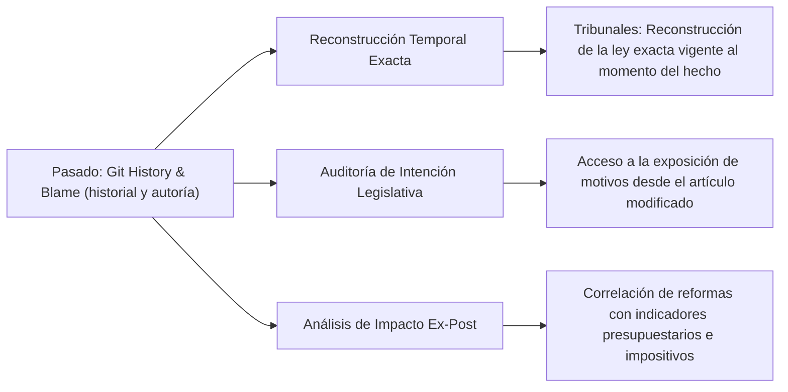
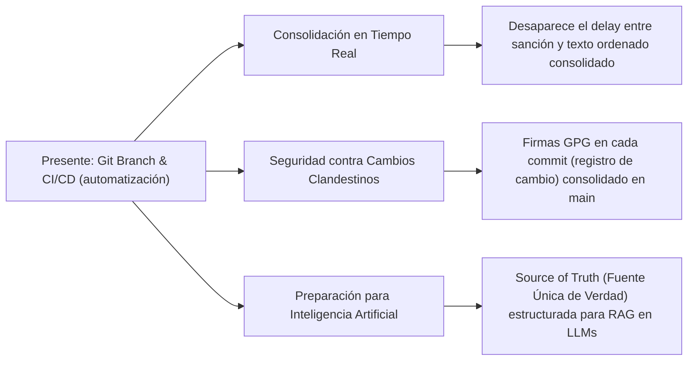
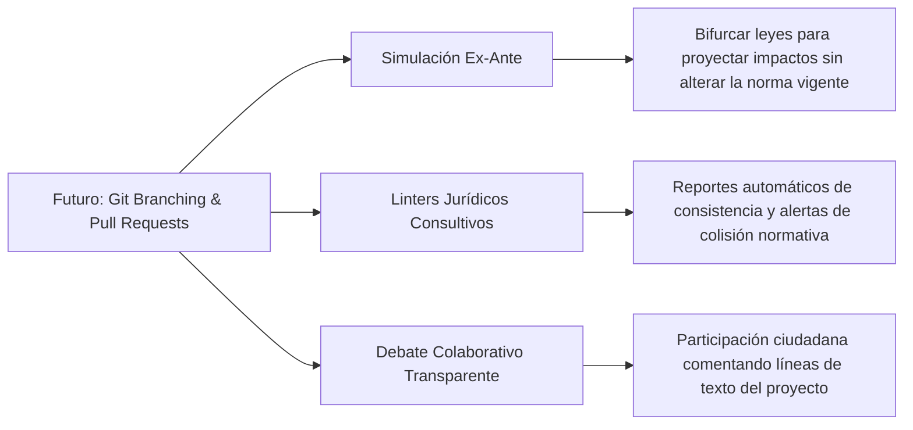

# El Impacto Temporal y Escenarios Prácticos de Git en la Legislación: Leyes.ar

Aplicar **Git** (sistema de control de versiones) a la legislación no es un simple cambio de formato; es un cambio de paradigma en la teoría y práctica del Derecho. Por primera vez en la historia, el cuerpo legal de una nación deja de ser una colección de documentos estáticos para convertirse en un **sistema dinámico, computable, auditable y predecible en el tiempo**.

A continuación, se detalla cómo el análisis temporal de Git (Pasado, Presente y Futuro) se conecta de forma directa con escenarios prácticos de la administración pública y la participación ciudadana en la Argentina.

---

## 1. El Pasado: Trazabilidad Histórica y Determinismo Jurídico

En el derecho tradicional, reconstruir el pasado normativo es una tarea compleja que requiere peritos legales y cotejo manual de boletines oficiales antiguos. Con Git, el pasado se vuelve determinista y computable:



*   **Aplicación de la Ley en el Tiempo (Irretroactividad):** Los jueces fallan sobre hechos del pasado bajo la ley vigente en ese preciso instante. Con un comando `git checkout (cambio de versión o fecha) <fecha_o_commit>`, un juzgado puede reconstruir instantáneamente el código penal o civil exacto tal como existía en el minuto en que ocurrió el litigio, eliminando cualquier duda sobre la vigencia temporal.
*   **Trazabilidad de la Intencionalidad (Git Blame -rastreo de autoría-):** Detrás de cada palabra de la ley hay una discusión política. Al usar `git blame` (comando de rastreo de cambios línea por línea), se expone el commit (registro de cambio) que insertó ese texto, conteniendo el nombre del legislador y el enlace a la exposición de motivos de la reforma.

### Casos Prácticos Asociados al Pasado:

#### Escenario A: Auditoría de Cambios Impositivos (Trazabilidad y Diffs)
*   **Problema Común:** Una empresa necesita saber con precisión en qué momento se incrementó una alícuota tributaria, qué ley lo dispuso y cuál era la redacción exacta del artículo antes del aumento para un reclamo de liquidaciones pasadas.
*   **Solución con Git:** Se ejecuta una consulta de historial sobre la línea del artículo impositivo. El sistema muestra un **"Diff" visual (comparación de cambios)** con la línea vieja en rojo y la nueva en verde:
    ```diff
    - Art. 12: La alícuota aplicable será del veinticinco por ciento (25%).
    + Art. 12: La alícuota aplicable será del treinta y cinco por ciento (35%).
    ```
    El cambio queda vinculado al identificador único de la enmienda (Commit Hash), que contiene la fecha de publicación, el número de ley sancionada y la exposición de motivos.

#### Escenario B: Corrección de una Derogación Accidental (Rollback Normativo)
*   **Problema Común:** El Congreso aprueba una ley que, debido a un error de redacción en su anexo derogatorio, deroga por accidente un artículo crítico de protección ambiental de una ley de 1995, generando un vacío legal inmediato.
*   **Solución con Git:** Se identifica el commit (registro de cambio) que provocó el error y se ejecuta una reversión parcial (`git revert` -reversión de cambio específico-). El sistema recupera el texto exacto del artículo derogado del historial inmutable, con sus puntos, comas y referencias originales en segundos para ser puesto a revalidación formal.

#### Escenario C: Trazabilidad Presupuestaria (Rastreo de Gastos e Impuestos)
*   **Problema Común:** El Estado aprueba anualmente la Ley de Presupuesto. Sin embargo, a lo largo del año, se realizan reasignaciones discrecionales (ej: quitando fondos a Educación para derivarlos a otras partidas). Para el ciudadano es imposible saber en tiempo real el destino de sus impuestos.
*   **Solución con Git:** La Ley de Presupuesto se estructura en Git como un árbol de archivos de datos. Cada reasignación presupuestaria obligatoriamente se procesa como un commit. El ciudadano puede hacer un seguimiento histórico y ver el historial del archivo `presupuesto-educacion.md`. Se expone visualmente el flujo de dinero público desde el momento en que se sanciona el impuesto hasta la ejecución real del gasto.

---

## 2. El Presente: Consolidación Inmediata y Seguridad Criptográfica

El estado actual de las leyes sufre de inconsistencias críticas debido al retardo e informalidades en las publicaciones. Git resuelve el presente jurídico mediante la automatización de la fe pública:



*   **Texto Ordenado Inmediato:** Al fusionar una enmienda en la rama principal (`main`), el texto consolidado y vigente queda disponible al segundo de su promulgación, sin retrasos de publicación física.
*   **Seguridad contra Cambios Clandestinos:** Ocasionalmente ocurren modificaciones silenciosas en el Boletín Oficial (fe de erratas no debatidas). En Git, cada cambio oficial debe estar firmado digitalmente con llaves criptográficas (GPG) por los Consolidadores Técnicos autorizados del digesto legislativo. Si un solo carácter cambia sin firma digital válida, el sistema lo detecta y rechaza la integración inmediatamente.
*   **Alimentación Limpia para la IA (RAG -consulta inteligente-):** El presente legislativo se convierte en una Fuente Única de Verdad estructurada en texto plano (Markdown). Las IAs legislativas pueden responder consultas sin alucinaciones, sabiendo exactamente qué normas están vigentes en el día de hoy.

### Casos Prácticos Asociados al Presente:

#### Escenario D: Auditoría de Lobby en Comisiones (Transparencia ante Modificaciones Ocultas)
*   **Problema Común:** Durante el debate en comisiones de un proyecto de ley sensible, se suelen introducir modificaciones de último momento a puertas cerradas que benefician a intereses particulares, difíciles de detectar por el ciudadano común.
*   **Solución con Git:** Cada cambio realizado a un proyecto de ley en comisión se registra como un commit (registro de cambio) en la rama del proyecto. Los ciudadanos pueden realizar un `git diff` (comando para ver diferencias de texto) entre la versión del proyecto original y la versión final que se somete a votación, exponiendo qué palabras o artículos se cambiaron y quién los sugirió.

---

## 3. El Futuro: Simulación Legislativa y Debate Predictivo

La redacción de leyes futuras suele ser reactiva e inconexa. Git introduce la capacidad de experimentar, simular y colaborar de manera ordenada antes de sancionar:



*   **Bifurcación para Simulación (Branching -ramas-):** Si el gobierno quiere proponer una reforma tributaria integral, se crea una rama `feature/reforma-tributaria-2027`. Esta rama modifica decenas de leyes impositivas en paralelo. Los analistas pueden correr simuladores sobre esta rama para proyectar el impacto económico cruzado, mientras la rama principal (`main`) sigue reflejando la ley vigente.
*   **Asistencia Técnica Automatizada (CI/CD):** Antes de votar una ley en el futuro, el pipeline de Git ejecuta validaciones automáticas y emite alertas de referencias jurídicas rotas o colisiones jerárquicas sin bloquear el debate parlamentario soberano.

### Casos Prácticos Asociados al Futuro:

#### Escenario E: Redacción Simultánea de Reformas al Código Civil (Branching y Control de Conflictos)
*   **Problema Común:** Dos comisiones parlamentarias diferentes trabajan al mismo tiempo en reformas sobre el mismo Código (ej. la Comisión de Familia reforma adopciones y la Comisión de Legislación General reforma contratos de alquiler).
*   **Solución con Git:** Cada comisión trabaja en su propia rama (`rama-adopcion` y `rama-alquileres`). Al unificar los proyectos con la rama `main` (rama de producción), Git detiene la operación si detecta que modificaron exactamente el mismo artículo, generando un **Conflicto de Fusión (Merge Conflict)**. El sistema obliga a las comisiones a coordinar y resolver la colisión antes de la votación en el recinto.

#### Escenario F: Prevención de Enlaces Rotos y Referencias Obsoletas (CI/CD Jurídico)
*   **Problema Común:** Un legislador presenta un proyecto de ley que establece sanciones penales basándose en las multas reguladas en el *"Artículo 45 de la Ley 24.156"*, el cual fue derogado hace un año, haciendo a la nueva ley inaplicable tras su sanción.
*   **Solución con Git:** Cuando el proyecto de ley es cargado en la rama propuesta (Pull Request), un motor de integración continua (CI/CD) analiza el archivo Markdown automáticamente. El script de validación (linter) busca el texto en el repositorio activo de leyes vigentes. Al no encontrarlo, emite un reporte de error de referencia rota, permitiendo corregir el error en etapa de comisión.

#### Escenario G: Iniciativa Popular mediante "Pull Requests" (Proposición Ciudadana Directa)
*   **Problema Común:** Un grupo de ciudadanos u ONGs quiere proponer una reforma para proteger los humedales. Tradicionalmente, deben juntar cientos de miles de firmas físicas en papel en un proceso costoso de nula transparencia.
*   **Solución con Git:** Los ciudadanos realizan una bifurcación (**Fork** -copia de repositorio independiente-) del repositorio oficial de leyes ambientales, escriben el artículo propuesto en el archivo Markdown y abren un **Pull Request (PR)** al repositorio del Congreso. La propuesta queda visible públicamente para toda la sociedad, obligando a los legisladores a debatirla o rechazarla con fundamentos públicos visibles en el historial.

#### Escenario H: Debate y Corrección Colaborativa en Línea (Issues y Comentarios de Línea)
*   **Problema Común:** Las audiencias públicas para debatir leyes complejas son de difícil acceso y no permiten que expertos o ciudadanos del interior del país opinen técnicamente sobre artículos específicos.
*   **Solución con Git:** El proyecto de ley se expone en la plataforma de Git. Cualquier ciudadano o especialista puede abrir un hilo de discusión (**Issue**) o comentar sobre una **línea de texto específica** del proyecto de ley de forma asincrónica.

#### Escenario I: Cooperación Federada entre Municipios (Forks de Ordenanzas)
*   **Problema Común:** Un municipio pequeño quiere regular el tratamiento de residuos electrónicos, pero carece de un equipo de abogados para redactar la ordenanza desde cero.
*   **Solución con Git:** El municipio pequeño realiza un **Fork** del repositorio de ordenanzas de un municipio que cuenta con una norma probada y moderna (ej. Rosario). Copian el archivo en su propio repositorio, adaptan los nombres y lo sancionan. Si el municipio pequeño realiza una mejora técnica en el texto, puede enviar una propuesta de vuelta (**Pull Request**) para que la incorporen, generando una red federal colaborativa de legislación municipal.

---

## Conclusión: Del "Derecho en Papel" al "Derecho como Código"

El impacto final es la transición del derecho analógico hacia el **"Derecho como Código" (Law as Code)**. 

Al tratar las leyes con las herramientas con las que se construye el software más complejo del mundo:
1.  **Eliminamos la incertidumbre jurídica formal.**
2.  **Reducimos los costos de administración pública y litigación.**
3.  **Habilitamos un ecosistema de innovación cívica e inteligencia artificial soberana.**

El control del tiempo que ofrece Git transforma a la ley de un texto estático a un organismo vivo, transparente y bajo control ciudadano.
