# Estrategia de Comunicación e Implementación por Audiencia: Leyes.ar

Para que el proyecto **Leyes.ar** sea exitoso, la comunicación debe adaptarse al lenguaje, necesidades y dolores de cada tipo de público interesado. No podemos explicarle el proyecto a un legislador usando el mismo lenguaje técnico de Git que usaríamos con un programador, ni con el lenguaje técnico-jurídico que usaríamos con un juez.

A continuación, se define el mapa de audiencias, el enfoque comunicativo personalizado y los pasos a seguir para involucrar a cada sector en la implementación.

---

## 1. Mapa de Audiencias Ampliado

Hemos identificado 7 audiencias clave que interactúan con la legislación:

```mermaid
graph TD
    Root["Leyes.ar"] --> Ciudadanos["Ciudadanos"]
    Root --> Profesionales["Profesionales del Derecho"]
    Root --> PoderLegislativo["Poder Legislativo"]
    Root --> SectorProductivo["Sector Productivo"]
    Root --> Academia["Academia"]
    Root --> SectorTecnologico["Sector Tecnológico"]
    Root --> SociedadCivil["Sociedad Civil"]

    Ciudadanos --> C1["Acceso simple"]
    Ciudadanos --> C2["Transparencia activa"]

    Profesionales --> P1["Abogados"]
    Profesionales --> P2["Jueces"]
    Profesionales --> P3["Escribanos"]

    PoderLegislativo --> PL1["Legisladores"]
    PoderLegislativo --> PL2["Asesores"]

    SectorProductivo --> SP1["Empresarios"]
    SectorProductivo --> SP2["LegalTech (tecnología jurídica)"]

    Academia --> A1["Estudiantes"]
    Academia --> A2["Docentes/Investigadores"]

    SectorTecnologico --> T1["Desarrolladores"]
    SectorTecnologico --> T2["Científicos de Datos"]

    SociedadCivil --> SC1["NGOs de Transparencia"]
    SociedadCivil --> SC2["Periodistas"]
```

---

## 2. Enfoque y Mensajes por Audiencia

### A. El Ciudadano Común
*   **Su Dolor:** *"Las leyes parecen escritas en otro idioma, están dispersas, y nunca sé a ciencia cierta qué está prohibido o permitido hoy."*
*   **Enfoque de Comunicación:** **Democratización y Claridad.**
*   **El Mensaje Clave:** *"Leyes.ar es como el 'Historial de Cambios' de un documento compartido, pero para las normas que rigen tu vida. Podrás ver en segundos qué cambió, cuándo cambió y quién lo decidió, sin rodeos técnicos."*
*   **Ventajas Clave:**
    *   **Acceso Universal:** El texto de cualquier ordenanza o ley nacional en tu celular, siempre en su versión real y vigente.
    *   **Comparación Visual Simplicada:** Ver qué cambió entre el texto viejo y el nuevo resaltado en rojo y verde, como en una corrección escolar.

---

### B. Estudiantes, Docentes e Investigadores
*   **Su Dolor:** *"Rastrear la evolución histórica de un artículo de un Código para una tesis o clase toma días de biblioteca comparando boletines antiguos."*
*   **Enfoque de Comunicación:** **Educación y Herramienta de Investigación.**
*   **El Mensaje Clave:** *"Una máquina del tiempo legislativa. Imagina poder estudiar cómo evolucionó el Código Penal argentino paso a paso, viendo el debate y los motivos exactos detrás de cada modificación de forma instantánea."*
*   **Ventajas Clave:**
    *   **Historial de Cambios Dinámico:** Reconstruir el estado exacto de una norma para cualquier fecha histórica de forma automática.
    *   **Análisis del Debate:** Acceso directo a los argumentos que llevaron a una reforma desde el mismo texto de la ley.

---

### C. Empresarios y Emprendedores (Sector Productivo y LegalTech -tecnología legal-)
*   **Su Dolor:** *"El 'riesgo regulatorio' en Argentina es altísimo. Las normativas cambian constantemente, los costos de consultoría legal para cumplir con las regulaciones (compliance -cumplimiento normativo regulatorio-) son elevados, y no hay APIs para automatizar procesos jurídicos."*
*   **Enfoque de Comunicación:** **Reducción de Costos, Certeza Jurídica e Innovación.**
*   **El Mensaje Clave:** *"Transformamos las leyes en infraestructura de datos abierta. Disminuye el costo de cumplimiento regulatorio y automatiza la auditoría de normas mediante software e inteligencia artificial."*
*   **Ventajas Clave:**
    *   **APIs (canales automáticos de consulta de datos) Gratuitas y Estructuradas:** Acceso a la legislación en JSON (formato estructurado de texto plano) para integrarla en sistemas empresariales de cumplimiento.
    *   **Alertas Regulatorias Automáticas:** Suscribirse a cambios en artículos específicos de leyes impositivas o de importación (como quien sigue un repositorio en GitHub -plataforma web para alojar proyectos Git-).

---

### D. Abogados, Jueces y Escribanos
*   **Su Dolor:** *"Litigar o sentenciar basándose en un texto derogado o mal consolidado. La pérdida de tiempo validando la vigencia de una norma en la fecha en que ocurrieron los hechos bajo juzgamiento."*
*   **Enfoque de Comunicación:** **Seguridad Jurídica y Precisión Técnica.**
*   **El Mensaje Clave:** *"Precisión milimétrica para tu práctica profesional. Garantía absoluta de vigencia de las normas y reconstrucción inmediata del texto de una ley al momento exacto de un hecho delictivo o contrato contractual."*
*   **Ventajas Clave:**
    *   **Fe de Erratas Cero:** Consolidación automática de reformas sin intervención manual propensa a errores.
    *   **Trazabilidad Temporal Definitiva:** Saber exactamente qué texto regía el 14 de mayo de 2021 a las 15:00 hs de manera indiscutible.

---

### E. Legisladores y Asesores Parlamentarios
*   **Su Dolor:** *"Sancionar leyes con fe de erratas, contradicciones normativas involuntarias o referencias a normas ya derogadas. El proceso de redacción colaborativa de un dictamen en comisión es caótico (cientos de emails con archivos de Word renombrados como 'DICTAMEN_FINAL_v3_CORREGIDO.docx')."*
*   **Enfoque de Comunicación:** **Eficiencia Técnica, Calidad Legislativa y Prestigio Institucional.**
*   **El Mensaje Clave:** *"Modernización legislativa real. Redacten proyectos en un entorno colaborativo transparente que previene errores de redacción, agiliza el consenso y reduce el costo de publicación."*
*   **Ventajas Clave:**
    *   **Redacción Colaborativa Controlada (Pull Requests -solicitudes de incorporación de cambios-):** Integrar propuestas de distintos bloques legislativos viendo exactamente quién sugiere qué palabra.
    *   **Linters (validadores automáticos de formato y estilo) Jurídicos:** Automatización que detecta si el proyecto de ley contradice la Constitución o cita normativas obsoletas antes de someterlo a votación.

---

### F. Desarrolladores de Software y Científicos de Datos
*   **Su Dolor:** *"Raspar (scrape) sitios del gobierno diseñados en los 90s, lidiando con captchas y PDFs rotos para extraer datos útiles."*
*   **Enfoque de Comunicación:** **Cultura Open Source (código abierto) y Datos Abiertos.**
*   **El Mensaje Clave:** *"La legislación argentina disponible a un \`git clone\` (comando de descarga del repositorio completo). Software libre y datos abiertos al servicio de la democracia."*
*   **Ventajas Clave:**
    *   **Formatos Amigables:** Leyes estructuradas en Markdown (formato de texto plano estructurado) / YAML (formato estructurado de datos) para su indexación en bases de datos vectoriales.
    *   **Ecosistema Colaborativo:** Posibilidad de desarrollar herramientas de visualización, bots de alertas o buscadores semánticos usando los repositorios oficiales.

---

### G. Organizaciones de la Sociedad Civil y Periodistas de Investigación
*   **Su Dolor:** *"Falta de herramientas objetivas para medir la productividad legislativa o auditar el lobby (cabildeo o presión de grupos de interés) de grupos de interés en la modificación de artículos."*
*   **Enfoque de Comunicación:** **Transparencia Activa y Anticorrupción.**
*   **El Mensaje Clave:** *"El primer registro inmutable de la actividad legislativa argentina. Audita cada cambio en el código fiscal o ambiental de tu provincia con nombre, apellido e historial de discusión pública."*
*   **Ventajas Clave:**
    *   **Auditoría de Lobby (presión de grupos de interés):** Rastrear cómo se modificó un proyecto desde su concepción hasta su sanción (historial de commits -registros de cambios- de la rama del proyecto).
    *   **Métricas de Trabajo Real:** Estadísticas basadas en datos duros del volumen e impacto de las enmiendas propuestas por cada bloque.

---

## 3. Estrategia de Comunicación en Tres Pasos (Primer Enfoque)

Para iniciar la comunicación y evangelización del proyecto, proponemos las siguientes tres acciones concretas:

### Paso 1: El "Demo" Legislativo (El Caso Testigo)
*   No expliques Git conceptualmente; muéstralo con un ejemplo histórico impactante.
*   **Acción:** Elegir una ley de alto impacto reciente (ej. *Ley de Alquileres* o *Reforma de la Ley de Contrato de Trabajo*). Construir un repositorio Git (sistema de control de versiones) demostrativo recreando su historia:
    *   **Commit 1 (primer registro de cambio):** Ley original.
    *   **Commit 2 (segundo registro de cambio):** Modificación A.
    *   **Commit 3 (tercer registro de cambio):** Modificación B.
*   Presentar el visor de Git en una web simple para que cualquier persona pueda arrastrar un control deslizante de tiempo y ver visualmente los cambios de texto en rojo y verde.

### Paso 2: El Programa "Concejo Abierto" (Piloto Municipal)
*   Los municipios son los laboratorios perfectos para este proyecto por su flexibilidad reglamentaria.
*   **Acción:** Presentar el proyecto a un Concejo Deliberante municipal innovador. Ofrecerles implementar `Leyes.ar` solo para sus **Ordenanzas Municipales** vigentes. Esto servirá como el primer caso de éxito real validado institucionalmente.

### Paso 3: El Hackathon Legislativo
*   Involucrar a la comunidad tecnológica y de estudiantes para poblar los primeros datos.
*   **Acción:** Organizar un evento colaborativo virtual para convertir las principales leyes nacionales (Códigos Civil, Penal, Comercial) de PDF/HTML a Markdown estructurado con metadatos. Esto genera comunidad y provee los cimientos de la base de datos libre de forma descentralizada.
