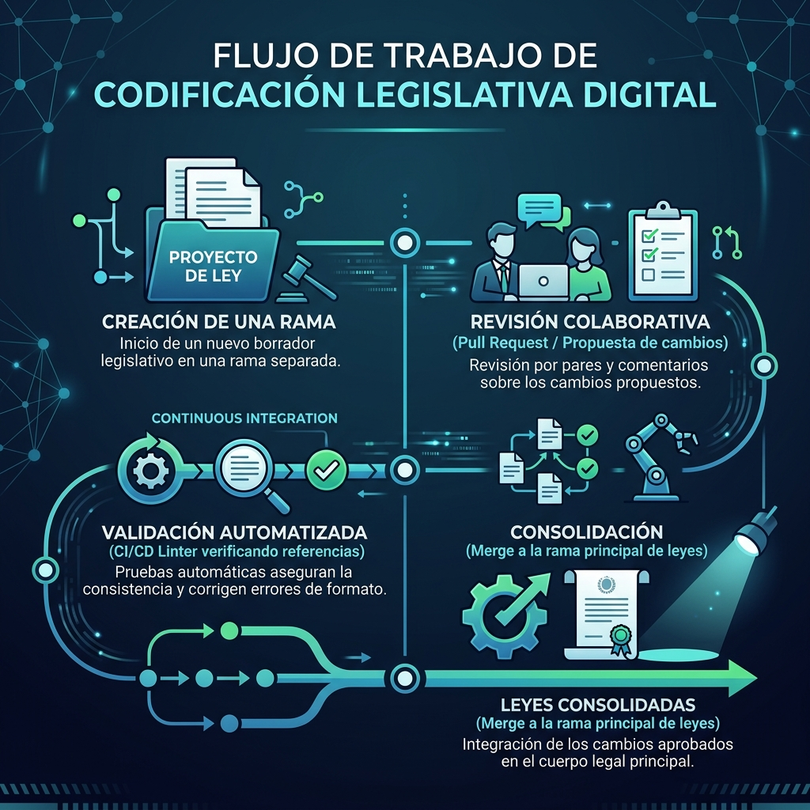
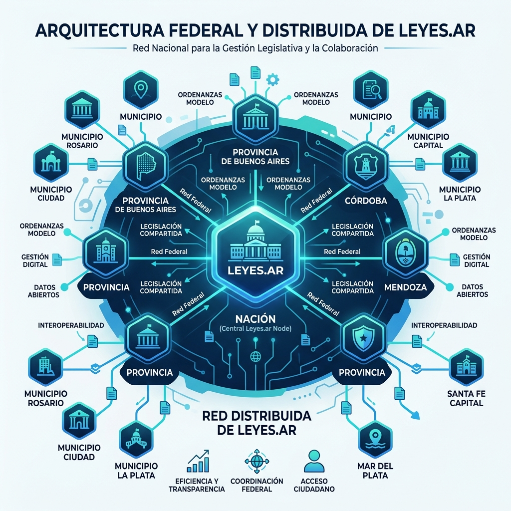
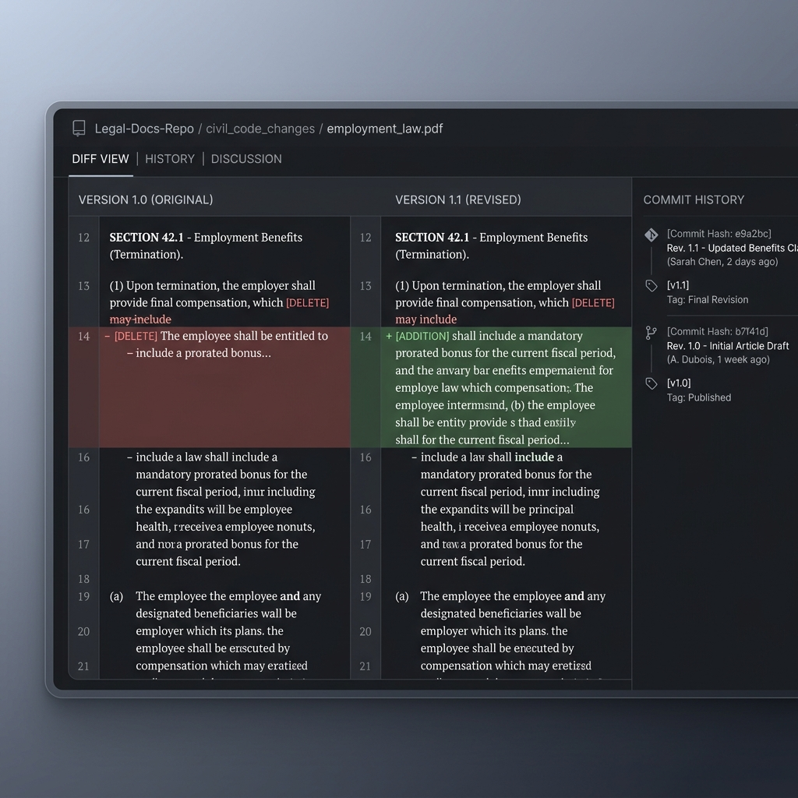

# Leyes.ar: Control de Versiones para la Legislación Argentina

Este es un proyecto estratégico nacional dedicado a implementar un sistema de control de versiones y colaboración basado en **Git** para todo el cuerpo normativo de la República Argentina, abarcando leyes nacionales, provinciales y ordenanzas municipales.

El proyecto propone implementar la **Codificación Digital de la Legislación** para erradicar la inseguridad jurídica formal, automatizar el control de calidad sintáctico de las normas (linters) y preparar al corpus legislativo para la integración nativa con sistemas avanzados de Inteligencia Artificial (arquitecturas RAG y modelos de lenguaje).

---

## 📊 Visualizaciones e Infografías del Ecosistema

Para facilitar la comprensión visual de los conceptos clave del proyecto, se presentan las siguientes infografías del ecosistema de **Leyes.ar**:

### 1. Flujo de Trabajo de la Codificación Digital
Ilustra el ciclo de vida de un proyecto normativo estructurado, desde la creación de una rama aislada hasta su consolidación oficial tras la sanción y promulgación constitucional.

---

### 2. Arquitectura de Red Federal y Descentralizada
Muestra el modelo de repositorio distribuido y federado que respeta la autonomía de las provincias y municipios argentinos, facilitando la adopción colaborativa de ordenanzas y leyes modelo.

---

### 3. Comparación Visual de Cambios (Diffs)
Muestra la interfaz visual simplificada que permite a ciudadanos, abogados y legisladores auditar con precisión quirúrgica qué palabras se eliminan (en rojo) y cuáles se añaden (en verde) en una reforma.

---

## 📂 Documentación del Proyecto

El repositorio está estructurado en las siguientes carpetas y documentos estratégicos:

*   **Gestión del Proyecto:**
    *   [ROADMAP.md](./ROADMAP.md): Ledger de Desarrollo y Hoja de Ruta. Centraliza la delimitación del alcance, el backlog de propuestas de mejora, las decisiones de diseño (ADRs) y el registro de correcciones.
*   **1. Estrategia (`1_estrategia/`):**
    *   [propuesta.md](./1_estrategia/propuesta.md): Documento estratégico integral que detalla la justificación conceptual y tecnológica de la solución, sus objetivos estratégicos (Misión, Visión, Objetivos), delimitación conceptual y las fases prácticas para su implementación gradual. Incluye una **Presentación e Introducción Gerencial** diseñada para tomadores de decisiones.
    *   [foda.md](./1_estrategia/foda.md): Análisis estratégico FODA (Fortalezas, Oportunidades, Debilidades, Amenazas) con matriz cruzada y diagramas de estrategias para la viabilidad institucional de Leyes.ar.
*   **2. Técnica y Casos de Uso (`2_tecnica_y_casos/`):**
    *   [impacto_temporal.md](./2_tecnica_y_casos/impacto_temporal.md): Estudio del impacto del control de versiones en la legislación en sus tres dimensiones temporales (pasado, presente, futuro) e integración de los 9 escenarios prácticos de uso gubernamental y de transparencia cívica (diffs, rollbacks, branching, CI/CD, pull requests, forks y trazabilidad presupuestaria).
    *   [delimitacion_juridica.md](./2_tecnica_y_casos/delimitacion_juridica.md): Estudio técnico-legal sobre la compatibilidad de las firmas de Git (GPG) con la Ley Nacional de Firma Digital N° 25.506 y la inalterabilidad de los códigos jurídicos sustanciales.
*   **3. Comunicación (`3_comunicacion/`):**
    *   [mapa_audiencias.md](./3_comunicacion/mapa_audiencias.md): Mapa de audiencias detallado (ciudadanos, estudiantes, abogados/jueces, legisladores, desarrolladores, sector empresarial y ONGs) con enfoques discursivos personalizados y una estrategia de comunicación e implementación en tres pasos.
    *   [didactica_perfiles.md](./3_comunicacion/didactica_perfiles.md): Guía didáctica y modular del concepto de "Codificación digital de la legislación" y el funcionamiento de Git explicados para tres perfiles de usuarios: no técnico, técnico-jurídico y tecnológico. Ideal para la generación de infografías y presentaciones.

---

## 🚀 Cómo Empezar

Para explorar o colaborar en la iniciativa, recomendamos la siguiente lectura secuencial:
1.  **Delimitación y Backlog:** Iniciar leyendo el [ROADMAP.md](./ROADMAP.md) para comprender la delimitación del proyecto.
2.  **Lectura Estratégica:** Continuar con la Presentación Gerencial y la Misión del proyecto en [propuesta.md](./1_estrategia/propuesta.md).
3.  **Técnica e Impacto:** Revisar cómo se resuelven situaciones legislativas reales en [impacto_temporal.md](./2_tecnica_y_casos/impacto_temporal.md).
4.  **Matriz de Comunicación:** Entender cómo se aborda a los distintos actores del ecosistema en [mapa_audiencias.md](./3_comunicacion/mapa_audiencias.md).
5.  **Fundamentos Didácticos:** Utilizar [didactica_perfiles.md](./3_comunicacion/didactica_perfiles.md) como base conceptual para evangelización, charlas o diseño gráfico del proyecto.
