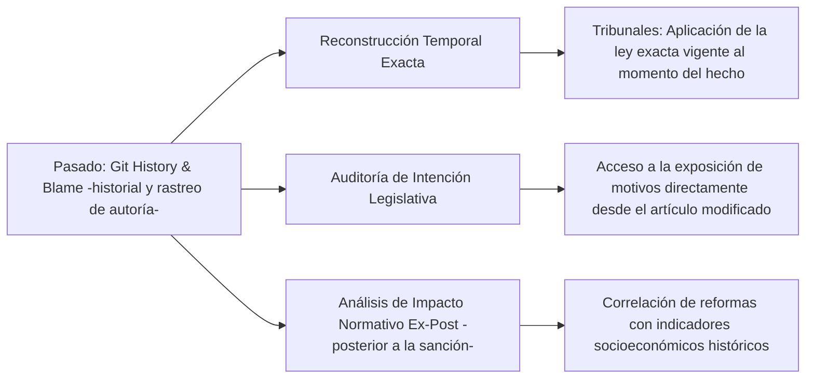
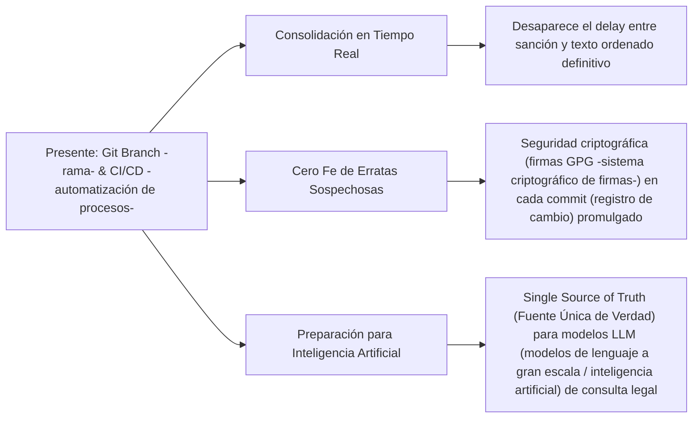

# El Impacto Real del Análisis Temporal (Pasado, Presente y Futuro) con Git en la Legislación

Aplicar **Git** a la legislación no es un simple cambio de formato; es un cambio de paradigma en la teoría y práctica del Derecho. Por primera vez en la historia, el cuerpo legal de una nación deja de ser una colección de documentos estáticos para convertirse en un **sistema dinámico, auditable y predecible en el tiempo**.

A continuación, se detalla el impacto real y transformador de analizar el historial y el seguimiento de los cambios en sus tres dimensiones temporales.

---

## 1. El Pasado: Arqueología Jurídica y Análisis de Impacto Histórico

En el derecho tradicional, reconstruir el pasado normativo es una tarea compleja que requiere peritos legales y cotejo manual de boletines. Con Git, el pasado se vuelve determinista y computable:



*   **Aplicación de la Ley en el Tiempo (Irretroactividad):** Los jueces fallan sobre hechos ocurridos en el pasado bajo la ley vigente en ese preciso momento. Con un simple comando `git checkout (comando de cambio de versión o fecha) <fecha_o_commit>`, un juzgado puede reconstruir instantáneamente el código penal o civil exacto tal como existía en el minuto en que ocurrió el litigio, eliminando cualquier duda sobre la vigencia temporal.
*   **Trazabilidad de la Intencionalidad (Git Blame -rastreo de autoría-):** Detrás de cada palabra de la ley hay una discusión política. Al hacer clic en un inciso (ej. usando `git blame` -comando de rastreo de cambios línea por línea-), se expone el commit (registro de cambio o confirmación) que lo insertó. Este commit contiene el nombre del legislador y el enlace a la exposición de motivos de la reforma, permitiendo una interpretación judicial fiel al espíritu original del legislador.
*   **Análisis Ex-Post y Ciencia de Datos:** Permite correlacionar de manera cuantitativa los cambios normativos históricos con bases de datos públicas (ej. tasa de criminalidad, recaudación fiscal, creación de empresas) para evaluar si una reforma del pasado cumplió con sus objetivos económicos o sociales.

---

## 2. El Presente: Consolidación, Auditoría e Integración Tecnológica

El estado actual de las leyes sufre de inconsistencias críticas debido al retardo y la desconexión informática en las publicaciones. Git resuelve el presente jurídico mediante la automatización:



*   **Texto Ordenado Inmediato:** Hoy, cuando se reforma un artículo, el ciudadano debe esperar meses (o años) a que el Poder Ejecutivo publique un "Texto Ordenado" consolidado de la ley. Con Git, el proceso de consolidación es inmediato tras el `merge` en la rama principal (`main`). La versión vigente siempre está disponible al segundo de su promulgación.
*   **Criptografía contra Cambios Clandestinos:** Ocasionalmente ocurren modificaciones "silenciosas" o errores de transcripción en el Boletín Oficial (las famosas "fe de erratas" que alteran el sentido de una norma). En Git, cada cambio oficial debe estar firmado digitalmente con llaves criptográficas (GPG -sistema de firmas criptográficas-) asociadas a la identidad de los Consolidadores Técnicos autorizados del digesto legislativo. Si un solo carácter de la ley consolidada cambia sin firma digital válida, el sistema lo detecta y rechaza el merge (fusión de cambios) en producción inmediatamente.
*   **Alimentación Limpia para la IA (RAG -Generación Aumentada por Recuperación / consulta inteligente-):** El presente legislativo se convierte en una **Fuente Única de Verdad (Single Source of Truth)** estructurada en texto plano (Markdown -formato de texto plano estructurado-). Los asistentes inteligentes de los estudios jurídicos o del Estado pueden responder consultas sin alucinaciones, sabiendo exactamente qué normas están vigentes hoy.

---

## 3. El Futuro: Simulación Legislativa y Debate Predictivo

La redacción de leyes futuras suele ser reactiva y caótica. Git introduce la capacidad de experimentar, simular y colaborar de manera ordenada antes de sancionar:

```mermaid
graph LR
    A[Futuro: Git Branching -ramas- & Pull Requests -solicitudes de cambios-] --> B[Simulación Ex-Ante -previa-]
    A --> C[Linters (validadores automáticos de formato) Jurídicos Consultivos]
    A --> D[Debate Colaborativo Transparente]
    
    B --> B1["Bifurcar leyes (crear copias independientes) para proyectar impactos sin alterar la norma vigente"]
    C --> C1["Reportes automatizados de consistencia y alertas de colisión normativa"]
    D --> D1["Participación ciudadana comentando líneas de texto específicas del proyecto"]
```

*   **Bifurcación para Simulación (Branching -creación de ramas-):** Si el gobierno quiere proponer una reforma tributaria integral, se crea una rama `feature/reforma-tributaria-2027`. Esta rama modifica decenas de leyes impositivas en paralelo. Los analistas pueden correr simuladores sobre esta rama para proyectar el impacto económico cruzado, mientras la rama principal (`main` -rama de producción-) sigue reflejando la ley vigente.
*   **Linters (validadores automáticos de formato y estilo) Jurídicos Consultivos (CI/CD -automatización de procesos-):** Antes de votar una ley en el futuro, el pipeline (flujo automatizado de procesos) de Git ejecuta validaciones automatizadas emitiendo reportes de advertencia técnica sin capacidad de bloquear el debate parlamentario soberano:
    *   *¿Este proyecto hace referencia a una ley derogada o artículo inexistente?* (Genera alerta de enlace jurídico roto).
    *   *¿La jerarquía de la norma propuesta colisiona con otra de rango superior?* (Alerta de conflicto de rango).
    *   *¿Falta estructuración formal en el artículo?* (Alerta de inconsistencia de formato).
*   **Debate Colaborativo en Pull Requests (solicitudes de incorporación de cambios):** Las futuras leyes se discuten sobre el texto propuesto. Los ciudadanos, legisladores y expertos pueden dejar comentarios en líneas de texto específicas del proyecto de ley, sugiriendo cambios puntuales, tal como se hace en la revisión de código de software. Esto democratiza y profesionaliza la técnica legislativa.

---

## Conclusión: Del "Derecho en Papel" al "Derecho como Código"

El impacto final es la transición del derecho analógico hacia el **"Derecho como Código" (Law as Code -el derecho como código-)**. 

Al tratar las leyes con las herramientas con las que se construye el software más complejo del mundo:
1.  **Eliminamos la incertidumbre jurídica.**
2.  **Reducimos los costos de administración pública y litigación.**
3.  **Habilitamos un ecosistema de innovación cívica e inteligencia artificial soberana.**

El control del tiempo que ofrece Git transforma a la ley de un texto estático a un organismo vivo, transparente y bajo control ciudadano.

